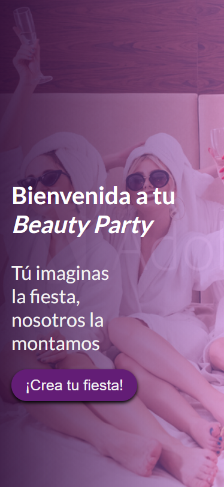
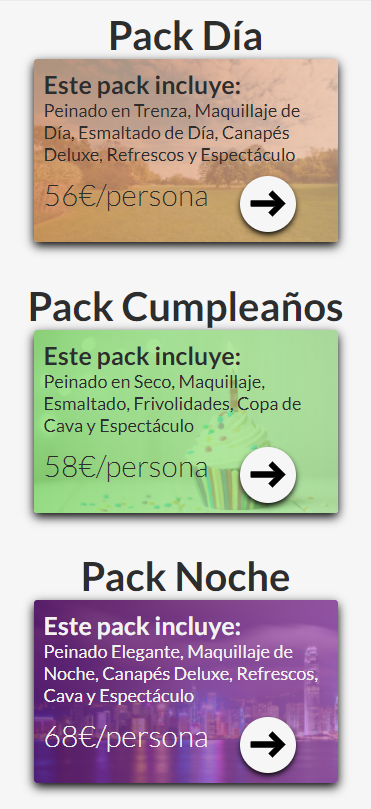
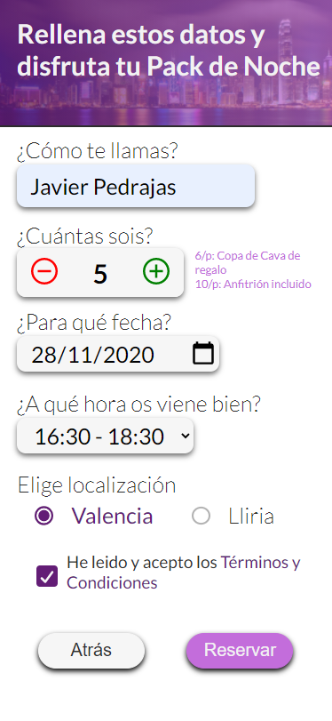
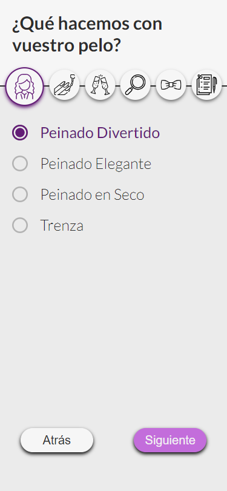

# BeautyParty Valencia

This is the showcase of my first work in React.

Website was developed for a local bussiness (hair salon)

### Landing Page

### Packs Page

### Night Pack Selected

### Start of Party Customization

### How do I make this work?
* Clone or Download the repository
* Open it with your code editor
* Run "npm install" in the terminal
* Run "npm start" in the terminal